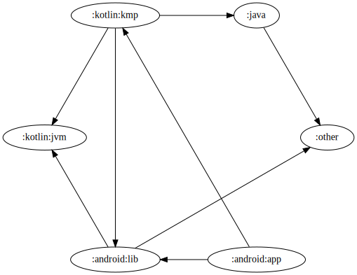
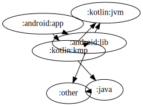

# Graphviz Config

## Overview

Graphviz is a very mature and customisable diagram generation tool. [See here for the official docs](https://graphviz.org/), or [here for an unofficial online playground](https://dreampuf.github.io/GraphvizOnline/).

You'll need to install Graphviz's binary executables separately, to use them as part of Atlas, [see here for steps](https://graphviz.org/download/).

Config is done with the `graphviz` lambda block within the base `atlas` extension:

``` kotlin
plugins {
  id("dev.jonpoulton.atlas.graphviz") version "x.y.z"
}

atlas {
  // other Atlas config - see common config docs

  graphviz {
    pathToDotCommand = "/path/to/dot"
    fileFormat = FileFormat.Svg
    layoutEngine = LayoutEngine.Dot

    node {
      // ...
    }

    edge {
      // ...
    }

    graph {
      // ...
    }
  }
}
```

!!! tip

    Graphviz is a very flexible framework, but it won't necessarily tell you if you don't configure things quite right. Plenty of config options require some other option to be set in a specific way, and the only way to figure it out is to:

    1. [RTFM](https://graphviz.org/), and
    2. [test your config in an online playground first](https://dreampuf.github.io/GraphvizOnline/).

    Remember this plugin is a thin wrapper around Graphviz! In most cases, it won't stop you from making config-related mistakes.

## Generated Files

Atlas Graphviz will generate a `chart.dot` file in each project directory, plus an image file based on your choice of [`fileFormat`](#fileformat). In the root project it'll also generate a `legend.dot` and an accompanying image. Both of these will be auto-added to the project readme when either `gradle atlasGenerate` or `gradle writeGraphvizReadme` is run.

## Properties

### pathToDotCommand

``` kotlin
atlas {
  graphviz {
    pathToDotCommand = "/path/to/dot"
  }
}
```

By default, Atlas will try to call `dot` from the system PATH. Use this to specify from a custom installation location instead.

### fileFormat

``` kotlin
atlas {
  graphviz {
    fileFormat = FileFormat.Svg
  }
}
```

There are plenty of options here, [all those specified in the Graphviz docs](https://graphviz.org/docs/outputs/) are provided as options by Atlas in the [`FileFormat` enum](api/atlas-graphviz/atlas.graphviz/-file-format/index.html). Not all have been tested, so please raise an issue on Github if you see anything weird.

### layoutEngine

``` kotlin
atlas {
  graphviz {
    layoutEngine = LayoutEngine.Dot
  }
}
```

DOT is Graphviz's standard engine, but others are available too. [See the docs here](https://graphviz.org/docs/layouts/). In my experience the only ones to give decent layouts for charts like these are:

- dot
- circo
- neato

though some of them (*cough* neato *cough*) will probably need tweaking of properties to make them look decent. Try experimenting to see what fits best.

<div class="side-by-side">
  <figure>
    
    <figcaption>dot</figcaption>
  </figure>
  <figure>
    
    <figcaption>circo</figcaption>
  </figure>
  <figure>
    
    <figcaption>neato</figcaption>
  </figure>
</div>

## Functions

As mentioned in [the Extra Properties section on the previous page](usage-common.md#extra-properties), the following three config sections all implement PropertiesSpec. As such, you can call `put("key", value)` within each of these lambda blocks to pass in your own config options - in case you want to set a property which hasn't been exposed by Atlas yet.

### node

Set a bunch of properties to be applied to all project nodes - unless overridden by [`projectTypes` config](usage-common.md#projecttypes). Some examples below, though you'll want to [go through the Graphviz docs](https://graphviz.org/docs/nodes/) for all restrictions/requirements:

``` kotlin
atlas {
  graphviz {
    node {
      fillColor = "red"
      fontColor = "white"
      shape = Shape.Box
      style = NodeStyle.Solid
    }
  }
}
```

!!! tip

    All properties available in `node { }` are also available when configuring individual `projectTypes`:

    ``` kotlin
    atlas {
      projectTypes {
        hasPluginId("Custom", "com.custom.plugin") {
          // overrides fill/shape for this project type only
          fillColor = "#ABC123"
          shape = Shape.Star
        }
      }

      node {
        // all others are red eggs by default
        fillColor = "red"
        shape = Shape.Egg
      }
    }
    ```

There's plenty you can do here, not all of it is immediately easy to figure out at a glance. Blame Graphviz, not me - this is simply a pass-through config layer. All node-specific properties - along with their types and associated Graphviz docs - are listed below. All properties are unset by default.

| Node Property | Type |
|--|--|
| [lineColor](https://graphviz.org/docs/attrs/color/) | String |
| [colorScheme](https://graphviz.org/docs/attrs/colorscheme/) | String |
| [comment](https://graphviz.org/docs/attrs/comment/) | String |
| [distortion](https://graphviz.org/docs/attrs/distortion/) | String |
| [fillColor](https://graphviz.org/docs/attrs/fillcolor/) | String |
| [fixedSize](https://graphviz.org/docs/attrs/fixedsize/) | String |
| [fontColor](https://graphviz.org/docs/attrs/fontcolor/) | String |
| [fontName](https://graphviz.org/docs/attrs/fontname/) | String |
| [fontSize](https://graphviz.org/docs/attrs/fontsize/) | String |
| [gradientAngle](https://graphviz.org/docs/attrs/gradientangle/) | Int |
| [group](https://graphviz.org/docs/attrs/group/) | String |
| [height](https://graphviz.org/docs/attrs/height/) | Number |
| [href](https://graphviz.org/docs/attrs/href/) | String |
| [id](https://graphviz.org/docs/attrs/id/) | String |
| [image](https://graphviz.org/docs/attrs/image/) | String |
| [imagePos](https://graphviz.org/docs/attrs/imagepos/) | [ImagePos](api/atlas-graphviz/atlas.graphviz/-node-attributes/image-pos.html) |
| [imageScale](https://graphviz.org/docs/attrs/imagescale/) | String |
| [label](https://graphviz.org/docs/attrs/label/) | String |
| [labelLoc](https://graphviz.org/docs/attrs/labelloc/) | String |
| [layer](https://graphviz.org/docs/attrs/layer/) | String |
| [margin](https://graphviz.org/docs/attrs/margin/) | String |
| [noJustify](https://graphviz.org/docs/attrs/nojustify/) | Boolean |
| [ordering](https://graphviz.org/docs/attrs/ordering/) | String |
| [orientation](https://graphviz.org/docs/attrs/orientation/) | Number |
| [penWidth](https://graphviz.org/docs/attrs/penwidth/) | Number |
| [peripheries](https://graphviz.org/docs/attrs/peripheries/) | Int |
| [pin](https://graphviz.org/docs/attrs/pin/) | Boolean |
| [pos](https://graphviz.org/docs/attrs/pos/) | String |
| [rects](https://graphviz.org/docs/attrs/rects/) | String |
| [regular](https://graphviz.org/docs/attrs/regular/) | Boolean |
| [root](https://graphviz.org/docs/attrs/root/) | String |
| [samplePoints](https://graphviz.org/docs/attrs/samplepoints/) | Int |
| [shape](https://graphviz.org/docs/attrs/shape/) | [Shape](api/atlas-graphviz/atlas.graphviz/-shape/index.html) |
| [shapeFile](https://graphviz.org/docs/attrs/shapefile/) | String |
| [showBoxes](https://graphviz.org/docs/attrs/showboxes/) | Int |
| [sides](https://graphviz.org/docs/attrs/sides/) | Int |
| [skew](https://graphviz.org/docs/attrs/skew/) | Number |
| [sortv](https://graphviz.org/docs/attrs/sortv/) | Int |
| [style](https://graphviz.org/docs/attrs/style/) | [NodeStyle](api/atlas-graphviz/atlas.graphviz/-node-style/index.html) |
| [target](https://graphviz.org/docs/attrs/target/) | String |
| [tooltip](https://graphviz.org/docs/attrs/tooltip/) | String |
| [url](https://graphviz.org/docs/attrs/URL/) | String |
| [vertices](https://graphviz.org/docs/attrs/vertices/) | String |
| [width](https://graphviz.org/docs/attrs/width/) | Number |
| [xlabel](https://graphviz.org/docs/attrs/xlabel/) | String |
| [xlp](https://graphviz.org/docs/attrs/xlp/) | String |
| [z](https://graphviz.org/docs/attrs/z/) | Number |

### edge

Set a bunch of properties to be applied to all links between project nodes - unless overridden by [`linkTypes` config](usage-common.md#linktypes). Some examples below, though you'll want to [go through the Graphviz docs](https://graphviz.org/docs/edges/) for all restrictions/requirements:

``` kotlin
atlas {
  graphviz {
    edge {
      linkColor = "red"
      fontColor = "white"
      arrowHead = ArrowType.Box
      weight = 2
    }
  }
}
```

There's plenty you can do here, not all of it is immediately easy to figure out at a glance. Blame Graphviz, not me - this is simply a pass-through config layer. All link-specific properties - along with their types and associated Graphviz docs - are listed below. All properties are unset by default.

!!! tip

    Same here for link styles as with node styles - any properties set in `edge` can be overridden by custom `linkTypes` config:

    ``` kotlin
    atlas {
      linkTypes {
        api {
          // overrides arrow/color for this link type only
          arrowHead = ArrowType.Diamond
          linkColor = "red"
        }

        implementation()
      }

      edge {
        // all others are black boxes by default
        arrowHead = ArrowType.Box
        linkColor = "black"
      }
    }
    ```

| Edge Property | Type |
|--|--|
| [arrowHead](https://graphviz.org/docs/attrs/arrowhead/) | [ArrowType](api/atlas-graphviz/atlas.graphviz/-arrow-type/index.html) |
| [arrowSize](https://graphviz.org/docs/attrs/arrowsize/) | Number |
| [arrowTail](https://graphviz.org/docs/attrs/arrowtail/) | [ArrowType](api/atlas-graphviz/atlas.graphviz/-arrow-type/index.html) |
| [linkColor](https://graphviz.org/docs/attrs/color/) | String |
| [colorScheme](https://graphviz.org/docs/attrs/colorscheme/) | String |
| [comment](https://graphviz.org/docs/attrs/comment/) | String |
| [constraint](https://graphviz.org/docs/attrs/constraint/) | Boolean |
| [decorate](https://graphviz.org/docs/attrs/decorate/) | Boolean |
| [dir](https://graphviz.org/docs/attrs/dir/) | [Dir](api/atlas-graphviz/atlas.graphviz/-dir/index.html) |
| [edgeHref](https://graphviz.org/docs/attrs/edgehref/) | String |
| [edgeTarget](https://graphviz.org/docs/attrs/edgetarget/) | String |
| [edgeTooltip](https://graphviz.org/docs/attrs/edgetooltip/) | String |
| [edgeUrl](https://graphviz.org/docs/attrs/edgeURL/) | String |
| [fillColor](https://graphviz.org/docs/attrs/fillcolor/) | String |
| [fontColor](https://graphviz.org/docs/attrs/fontcolor/) | String |
| [fontName](https://graphviz.org/docs/attrs/fontname/) | String |
| [fontSize](https://graphviz.org/docs/attrs/fontsize/) | String |
| [headLp](https://graphviz.org/docs/attrs/head_lp/) | String |
| [headClip](https://graphviz.org/docs/attrs/headclip/) | Boolean |
| [headHref](https://graphviz.org/docs/attrs/headhref/) | String |
| [headLabel](https://graphviz.org/docs/attrs/headlabel/) | String |
| [headPort](https://graphviz.org/docs/attrs/headport/) | String |
| [headTarget](https://graphviz.org/docs/attrs/headtarget/) | String |
| [headTooltip](https://graphviz.org/docs/attrs/headtooltip/) | String |
| [headUrl](https://graphviz.org/docs/attrs/headURL/) | String |
| [href](https://graphviz.org/docs/attrs/href/) | String |
| [id](https://graphviz.org/docs/attrs/id/) | String |
| [label](https://graphviz.org/docs/attrs/label/) | String |
| [labelAngle](https://graphviz.org/docs/attrs/labelangle/) | Number |
| [labelDistance](https://graphviz.org/docs/attrs/labeldistance/) | Number |
| [labelFloat](https://graphviz.org/docs/attrs/labelfloat/) | Boolean |
| [labelFontColor](https://graphviz.org/docs/attrs/labelfontcolor/) | String |
| [labelFontName](https://graphviz.org/docs/attrs/labelfontname/) | String |
| [labelFontSize](https://graphviz.org/docs/attrs/labelfontsize/) | String |
| [labelHref](https://graphviz.org/docs/attrs/labelhref/) | String |
| [labelTarget](https://graphviz.org/docs/attrs/labeltarget/) | String |
| [labelTooltip](https://graphviz.org/docs/attrs/labeltooltip/) | String |
| [labelUrl](https://graphviz.org/docs/attrs/labelurl/) | String |
| [layer](https://graphviz.org/docs/attrs/layer/) | String |
| [len](https://graphviz.org/docs/attrs/len/) | Number |
| [lhead](https://graphviz.org/docs/attrs/lhead/) | String |
| [lp](https://graphviz.org/docs/attrs/lp/) | String |
| [ltail](https://graphviz.org/docs/attrs/ltail/) | String |
| [minLen](https://graphviz.org/docs/attrs/minlen/) | Int |
| [noJustify](https://graphviz.org/docs/attrs/nojustify/) | Boolean |
| [penWidth](https://graphviz.org/docs/attrs/penwidth/) | Number |
| [pos](https://graphviz.org/docs/attrs/pos/) | String |
| [sameHead](https://graphviz.org/docs/attrs/samehead/) | String |
| [sameTail](https://graphviz.org/docs/attrs/sametail/) | String |
| [showBoxes](https://graphviz.org/docs/attrs/showboxes/) | Int |
| [linkStyle](https://graphviz.org/docs/attrs/style/) | [LinkStyle](api/atlas-graphviz/atlas.graphviz/-link-style/index.html) |
| [tailLp](https://graphviz.org/docs/attrs/tail_lp/) | String |
| [tailClip](https://graphviz.org/docs/attrs/tailclip/) | Boolean |
| [tailHref](https://graphviz.org/docs/attrs/tailhref/) | String |
| [tailLabel](https://graphviz.org/docs/attrs/taillabel/) | String |
| [tailPort](https://graphviz.org/docs/attrs/tailport/) | String |
| [tailTarget](https://graphviz.org/docs/attrs/tailtarget/) | String |
| [tailTooltip](https://graphviz.org/docs/attrs/tailtooltip/) | String |
| [tailUrl](https://graphviz.org/docs/attrs/tailURL/) | String |
| [target](https://graphviz.org/docs/attrs/target/) | String |
| [tooltip](https://graphviz.org/docs/attrs/tooltip/) | String |
| [url](https://graphviz.org/docs/attrs/url/) | String |
| [weight](https://graphviz.org/docs/attrs/weight/) | Number |
| [xLabel](https://graphviz.org/docs/attrs/xlabel/) | String |
| [xlp](https://graphviz.org/docs/attrs/xlp/) | String |

### graph

Set a bunch of properties to be applied to the chart itself. Some examples below, though you'll want to [go through the Graphviz docs](https://graphviz.org/docs/edges/) for all restrictions/requirements:

``` kotlin
atlas {
  graphviz {
    graph {
      bgColor = "black"
      fontColor = "white"
      labelLoc = "b"
    }
  }
}
```

| Graph Property | Type |
|--|--|
| [background](https://graphviz.org/docs/attrs/background/) | String |
| [bb](https://graphviz.org/docs/attrs/bb/) | String |
| [beautify](https://graphviz.org/docs/attrs/beautify/) | Boolean |
| [bgColor](https://graphviz.org/docs/attrs/bgcolor/) | String |
| [center](https://graphviz.org/docs/attrs/center/) | Boolean |
| [charset](https://graphviz.org/docs/attrs/charset/) | String |
| [clusterRank](https://graphviz.org/docs/attrs/clusterrank/) | ClusterMode |
| [colorScheme](https://graphviz.org/docs/attrs/colorscheme/) | String |
| [comment](https://graphviz.org/docs/attrs/comment/) | String |
| [compound](https://graphviz.org/docs/attrs/compound/) | Boolean |
| [concentrate](https://graphviz.org/docs/attrs/concentrate/) | Boolean |
| [damping](https://graphviz.org/docs/attrs/Damping/) | Float |
| [defaultDist](https://graphviz.org/docs/attrs/defaultdist/) | Number |
| [dim](https://graphviz.org/docs/attrs/dim/) | Int |
| [dimen](https://graphviz.org/docs/attrs/dimen/) | Int |
| [dirEdgeConstraints](https://graphviz.org/docs/attrs/diredgeconstraints/) | String |
| [dpi](https://graphviz.org/docs/attrs/dpi/) | Number |
| [epsilon](https://graphviz.org/docs/attrs/epsilon/) | Float |
| [esep](https://graphviz.org/docs/attrs/esep/) | String |
| [fontColor](https://graphviz.org/docs/attrs/fontcolor/) | String |
| [fontName](https://graphviz.org/docs/attrs/fontname/) | String |
| [fontNames](https://graphviz.org/docs/attrs/fontnames/) | String |
| [fontPath](https://graphviz.org/docs/attrs/fontpath/) | String |
| [fontSize](https://graphviz.org/docs/attrs/fontsize/) | String |
| [forceLabels](https://graphviz.org/docs/attrs/forcelabels/) | Boolean |
| [gradientAngle](https://graphviz.org/docs/attrs/gradientangle/) | Int |
| [href](https://graphviz.org/docs/attrs/href/) | String |
| [id](https://graphviz.org/docs/attrs/id/) | String |
| [imagePath](https://graphviz.org/docs/attrs/imagepath/) | String |
| [inputScale](https://graphviz.org/docs/attrs/inputscale/) | Number |
| [k](https://graphviz.org/docs/attrs/K/) | Number |
| [label](https://graphviz.org/docs/attrs/label/) | String |
| [labelScheme](https://graphviz.org/docs/attrs/label_scheme/) | Int |
| [labelJust](https://graphviz.org/docs/attrs/labeljust/) | String |
| [labelLoc](https://graphviz.org/docs/attrs/labelloc/) | String |
| [landscape](https://graphviz.org/docs/attrs/landscape/) | Boolean |
| [layerListSep](https://graphviz.org/docs/attrs/layerlistsep/) | String |
| [layers](https://graphviz.org/docs/attrs/layers/) | String |
| [layerSelect](https://graphviz.org/docs/attrs/layerselect/) | String |
| [layerSep](https://graphviz.org/docs/attrs/layersep/) | String |
| [layout](https://graphviz.org/docs/attrs/layout/) | LayoutEngine |
| [levels](https://graphviz.org/docs/attrs/levels/) | Int |
| [levelsGap](https://graphviz.org/docs/attrs/levelsgap/) | Number |
| [lheight](https://graphviz.org/docs/attrs/lheight/) | Number |
| [lineLength](https://graphviz.org/docs/attrs/linelength/) | Int |
| [lp](https://graphviz.org/docs/attrs/lp/) | String |
| [lWidth](https://graphviz.org/docs/attrs/lwidth/) | Number |
| [margin](https://graphviz.org/docs/attrs/margin/) | String |
| [maxiter](https://graphviz.org/docs/attrs/maxiter/) | Int |
| [mcLimit](https://graphviz.org/docs/attrs/mclimit/) | Number |
| [minDist](https://graphviz.org/docs/attrs/mindist/) | Number |
| [mode](https://graphviz.org/docs/attrs/mode/) | String |
| [model](https://graphviz.org/docs/attrs/model/) | String |
| [newRank](https://graphviz.org/docs/attrs/newrank/) | Boolean |
| [nodeSep](https://graphviz.org/docs/attrs/nodesep/) | Number |
| [noJustify](https://graphviz.org/docs/attrs/nojustify/) | Boolean |
| [normalize](https://graphviz.org/docs/attrs/normalize/) | String |
| [noTranslate](https://graphviz.org/docs/attrs/notranslate/) | Boolean |
| [nsLimit](https://graphviz.org/docs/attrs/nslimit/) | Number |
| [nsLimit1](https://graphviz.org/docs/attrs/nslimit1/) | Number |
| [oneBlock](https://graphviz.org/docs/attrs/oneblock/) | Boolean |
| [ordering](https://graphviz.org/docs/attrs/ordering/) | String |
| [orientation](https://graphviz.org/docs/attrs/orientation/) | Number |
| [outputOrder](https://graphviz.org/docs/attrs/outputorder/) | String |
| [overlap](https://graphviz.org/docs/attrs/overlap/) | String |
| [overlapScaling](https://graphviz.org/docs/attrs/overlap_scaling/) | Number |
| [overlapShrink](https://graphviz.org/docs/attrs/overlap_shrink/) | Boolean |
| [pack](https://graphviz.org/docs/attrs/pack/) | String |
| [packMode](https://graphviz.org/docs/attrs/packmode/) | String |
| [pad](https://graphviz.org/docs/attrs/pad/) | String |
| [page](https://graphviz.org/docs/attrs/page/) | String |
| [pageDir](https://graphviz.org/docs/attrs/pagedir/) | String |
| [quadTree](https://graphviz.org/docs/attrs/quadtree/) | String |
| [quantum](https://graphviz.org/docs/attrs/quantum/) | Number |
| [rankDir](https://graphviz.org/docs/attrs/rankdir/) | RankDir |
| [rankSep](https://graphviz.org/docs/attrs/ranksep/) | Number |
| [ratio](https://graphviz.org/docs/attrs/ratio/) | String |
| [reminCross](https://graphviz.org/docs/attrs/remincross/) | Boolean |
| [repulsiveForce](https://graphviz.org/docs/attrs/repulsiveforce/) | Number |
| [resolution](https://graphviz.org/docs/attrs/resolution/) | Number |
| [root](https://graphviz.org/docs/attrs/root/) | String |
| [rotate](https://graphviz.org/docs/attrs/rotate/) | Int |
| [rotation](https://graphviz.org/docs/attrs/rotation/) | Number |
| [scale](https://graphviz.org/docs/attrs/scale/) | String |
| [searchSize](https://graphviz.org/docs/attrs/searchsize/) | Int |
| [sep](https://graphviz.org/docs/attrs/sep/) | String |
| [showBoxes](https://graphviz.org/docs/attrs/showboxes/) | Int |
| [size](https://graphviz.org/docs/attrs/size/) | String |
| [smoothing](https://graphviz.org/docs/attrs/smoothing/) | SmoothType |
| [sortv](https://graphviz.org/docs/attrs/sortv/) | Int |
| [splines](https://graphviz.org/docs/attrs/splines/) | String |
| [start](https://graphviz.org/docs/attrs/start/) | String |
| [style](https://graphviz.org/docs/attrs/style/) | String |
| [styleSheet](https://graphviz.org/docs/attrs/stylesheet/) | String |
| [target](https://graphviz.org/docs/attrs/target/) | String |
| [tbBalance](https://graphviz.org/docs/attrs/TBbalance/) | String |
| [tooltip](https://graphviz.org/docs/attrs/tooltip/) | String |
| [trueColor](https://graphviz.org/docs/attrs/truecolor/) | Boolean |
| [url](https://graphviz.org/docs/attrs/URL/) | String |
| [viewPort](https://graphviz.org/docs/attrs/viewport/) | String |
| [voroMargin](https://graphviz.org/docs/attrs/voro_margin/) | Number |
| [xdotVersion](https://graphviz.org/docs/attrs/xdotversion/) | String |
