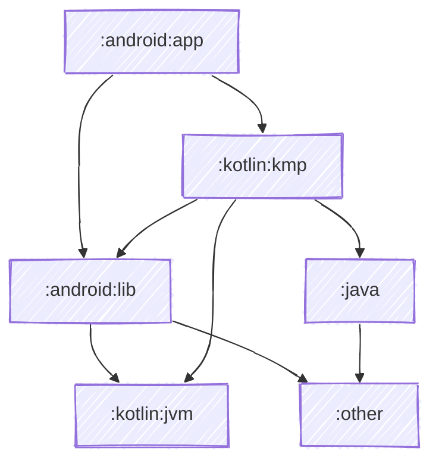

# Mermaid Config

## Overview

Mermaid is a JavaScript-based diagramming and charting tool that renders Markdown-inspired text definitions to create diagrams dynamically. [See here for the official Mermaid docs](https://mermaid.js.org/) or [here for an online playground](https://mermaid.live/).

Unlike D2 and Graphviz, Mermaid diagrams don't require any external executable to be installed - they're rendered directly in Markdown viewers like GitHub, GitLab, and many IDEs including IntelliJ IDEA. This makes Mermaid diagrams highly portable and easy to share.

Mermaid-specific configuration is performed from the `mermaid { }` block within the base `atlas` extension function:

``` kotlin
plugins {
  id("dev.jonpoulton.atlas.mermaid") version "x.y.z"
}

atlas {
  // other Atlas config - see common config docs

  mermaid {
    animateLinks = false
    look = Look.HandDrawn
    theme = Theme.Forest

    elk {
      mergeEdges = true
      nodePlacementStrategy = NodePlacementStrategy.LinearSegments
      cycleBreakingStrategy = CycleBreakingStrategy.Interactive
      considerModelOrder = ConsiderModelOrder.PreferEdges
      forceNodeModelOrder = true
    }

    layout {
      // custom layout properties
    }

    themeVariables {
      background = "white"
      fontFamily = "arial"
      lineColor = "#55FF55"
      primaryBorderColor = "#FF5555"
      primaryColor = "#ABC123"
    }
  }
}
```

or a barebones config:

``` kotlin
plugins {
  id("dev.jonpoulton.atlas.mermaid") version "x.y.z"
}
```

The above barebones config will output a diagram like below:


## Generated Files

The Mermaid plugin will generate a `chart.mmd` file in each subproject's `atlas/` folder, containing the Mermaid flowchart diagram for that project's dependencies. In the root project, it will also generate a `legend.md` file containing a legend of any defined project types and link types.

These `.mmd` files can be embedded directly in Markdown files or rendered by compatible viewers (such as this page!). Many platforms (GitHub, GitLab, etc.) will automatically render Mermaid diagrams when viewing `.md` files containing mermaid code blocks.

## Properties

### animateLinks

``` kotlin
atlas {
  mermaid {
    animateLinks = true
  }
}
```

When enabled, links between all project nodes will have animation applied to them. Disabled by default.

[See the Mermaid docs for more details](https://mermaid.js.org/syntax/flowchart.html#turning-an-animation-on).

!!! warning

    This feature doesn't currently work on GitHub or in IntelliJ's Mermaid renderers, but it does work on [mermaid.live](https://mermaid.live) and this very website (see below). IntelliJ breaks rendering completely when this is enabled, while GitHub still renders the diagram but ignores the animation. Not recommended for practical use in shared documentation, but it does look cool when it works!


### look

``` kotlin
atlas {
  mermaid {
    look = Look.HandDrawn
  }
}
```

Controls the visual style of the diagram. Available options:

``` kotlin
Look.Classic      // Standard clean diagram style (default)
Look.HandDrawn    // Sketch-like hand-drawn appearance
```

The `HandDrawn` look gives diagrams a more informal, sketchy appearance similar to Excalidraw.

[See the Mermaid docs for more details](https://mermaid.js.org/intro/syntax-reference.html#layout-and-look).

!!! tip

    Hand-drawn does look a bit janky by default on some platforms in dark mode. On this site for example, the text color doesn't flip to black as it does in classic.

`Look.HandDrawn`:



`Look.Classic`:


### theme

``` kotlin
atlas {
  mermaid {
    theme = Theme.Forest
  }
}
```

Applies a built-in Mermaid color scheme to your charts. Available options:

``` kotlin
Theme.Default   // Mermaid's default theme
Theme.Neutral   // Neutral colors
Theme.Dark      // Dark mode theme
Theme.Forest    // Forest green theme
Theme.Base      // Minimal base theme
```

!!! info

    If you set specific colors for a project type using the `projectTypes` API, they will override the theme color for those nodes. Same applies to link colors configured via `linkTypes`.

[See the Mermaid docs for all available themes](https://mermaid.js.org/config/theming.html).

| Neutral | Dark |
|:--:|:--:|
|  |  |
| Forest | Base |
|  |  |

## Functions

### elk

``` kotlin
atlas {
  mermaid {
    // use the default configs:
    elk()

    // customise the layout config:
    elk {
      mergeEdges = true
      nodePlacementStrategy = NodePlacementStrategy.LinearSegments
      cycleBreakingStrategy = CycleBreakingStrategy.Interactive
      considerModelOrder = ConsiderModelOrder.PreferEdges
      forceNodeModelOrder = true
    }
  }
}
```

Configures the [ELK (Eclipse Layout Kernel)](https://www.eclipse.org/elk/) layout engine for Mermaid diagrams. [See the Mermaid ELK configuration docs](https://mermaid.js.org/config/schema-docs/config-properties-elk.html) for detailed information. Basic output for the default configuration:


#### mergeEdges

Allows edges to share paths where convenient. Can create cleaner diagrams but may be harder to follow in complex graphs. Defaults to false.


#### nodePlacementStrategy

Controls how nodes are positioned within layers. Defaults to `NodePlacementStrategy.BrandesKoepf`.

| Simple | NetworkSimplex |
|:--:|:--:|
|  |  |
| LinearSegments | BrandesKoepf |
|  |  |

#### cycleBreakingStrategy

Determines how to find and break cycles in the graph. Defaults to `CycleBreakingStrategy.GreedyModelOrder`. Options:

- Greedy
- DepthFirst
- Interactive
- ModelOrder

These can't easily be demonstrated because they don't affect simple diagrams, but the option's here if you need it.

#### considerModelOrder

Controls whether to preserve the order of nodes/edges from the model file. Defaults to `ConsiderModelOrder.NodesAndEdges`. Options:

- None
- NodesAndEdges
- PreferEdges
- PreferNodes

These can't easily be demonstrated because they don't affect simple diagrams, but the option's here if you need it.

#### forceNodeModelOrder

Preserves the model's node order without changes during layout. Requires `considerModelOrder` to be set appropriately. Defaults to false.

### layout

``` kotlin
atlas {
  mermaid {
    layout {
      name = "dagre"
      put("customProperty", "value")
    }
  }
}
```

Allows you to set a custom layout engine name and any additional properties. The default layout engine is "dagre" if not specified.

!!! tip

    For ELK configuration, use the dedicated `elk { }` function instead, which provides typed properties for all ELK-specific options.

The `layout` function is primarily useful if:
1. You want to explicitly set the layout to "dagre" (though this is the default)
2. Future Mermaid versions add new layout engines
3. You need to pass custom properties using the `put()` method

This function implements `PropertiesSpec`, so you can use `put("key", value)` to add custom key/value pairs.

[See the Mermaid docs on layouts](https://mermaid.js.org/config/layouts.html).

### themeVariables

``` kotlin
atlas {
  mermaid {
    themeVariables {
      background = "#FFF"
      darkMode = true
      fontFamily = "arial"
      fontSize = "16px"
      lineColor = "#55FF55"
      primaryBorderColor = "#FF5555"
      primaryColor = "#ABC123"
      primaryTextColor = "#000"
      secondaryColor = "#DEF456"
      tertiaryColor = "#789ABC"

      // Use put() for any additional theme variables
      put("defaultLinkColor", "#5555FF")
    }
  }
}
```

Configures global theme variables that control the appearance of the diagram. These variables allow fine-grained control over colors and styling beyond what the preset themes provide.

Available typed properties:

| Property | Type | Description |
|----------|------|-------------|
| **background** | String | Background color of the diagram |
| **darkMode** | Boolean | Enable dark mode styling |
| **fontFamily** | String | Font family for all text |
| **fontSize** | String | Base font size (e.g., "16px") |
| **lineColor** | String | Default color for lines/edges |
| **primaryBorderColor** | String | Border color for primary elements |
| **primaryColor** | String | Primary fill color |
| **primaryTextColor** | String | Text color for primary elements |
| **secondaryColor** | String | Secondary fill color |
| **tertiaryColor** | String | Tertiary fill color |

!!! tip

    This function implements `PropertiesSpec`, so you can use `put("key", "value")` to set any additional theme variables not explicitly listed above. See [the Mermaid theming docs](https://mermaid.js.org/config/theming.html#theme-variables) for all available variables.

!!! info

    Theme variables work in conjunction with the `theme` property. Some variables may be overridden by the selected theme, while others will take precedence depending on the variable.

Colors can be specified as:

- CSS color names (e.g., "red", "forestgreen")
- Hex values (e.g., "#FF5555", "#ABC123")
- RGB/RGBA values (e.g., "rgb(255, 85, 85)")

### Project Type Styling

When configuring project types for Mermaid, you can use Mermaid-specific styling properties:

``` kotlin
atlas {
  projectTypes {
    androidApp()
    kotlinMultiplatform {
      fontColor = "white"
      fontSize = "20px"
      stroke = "#FF5555"
      strokeDashArray = "4 3 2 1"
      strokeWidth = "3px"
    }
    other()
  }
}
```

Available properties for [MermaidProjectTypeSpec](api/atlas-mermaid/atlas.mermaid/-mermaid-project-type-spec/index.html):

| Property | Type | Description |
|----------|------|-------------|
| **fontColor** | String | Color of the text in the node |
| **fontSize** | String | Size of the text (e.g., "20px") |
| **stroke** | String | Color of the node border |
| **strokeDashArray** | String | Dash pattern for the border (e.g., "5 5" or "4 3 2 1") |
| **strokeWidth** | String | Width of the node border (e.g., "3px" or "3") |

!!! warning

    Atlas won't validate these values - you need to ensure they're in the correct format. For example, `strokeDashArray` should be space-separated numbers, and `strokeWidth` can be either a pixel value ("5px") or a plain integer ("5"). [See the Mermaid docs for expected formats](https://mermaid.js.org/syntax/flowchart.html#styling-a-node).

### Link Type Styling

When configuring link types for Mermaid, you can use Mermaid-specific styling properties:

``` kotlin
atlas {
  linkTypes {
    api(LinkStyle.Basic) {
      fontColor = "blue"
      stroke = "red"
      strokeWidth = "5px"
    }

    implementation(LinkStyle.Dashed) {
      stroke = "aqua"
      strokeDashArray = "5 5"
    }

    "jvmMainImplementation"(LinkStyle.Bold, color = "orange")
  }
}
```

Available link styles:

``` kotlin
LinkStyle.Basic      // Solid line with arrow (default)
LinkStyle.Bold       // Thick solid line with arrow
LinkStyle.Dashed     // Dashed line with arrow
LinkStyle.Invisible  // Hidden link (still affects layout)
```

| Basic | Bold |
|:--:|:--:|
|  |  |
| Dashed | Invisible |
|  |  |


Available properties for [MermaidLinkTypeSpec](api/atlas-mermaid/atlas.mermaid/-mermaid-link-type-spec/index.html):

| Property | Type | Description |
|----------|------|-------------|
| **fontColor** | String | Color of the link label text |
| **stroke** | String | Color of the link line |
| **strokeWidth** | String | Width of the link line (e.g., "5px") |
| **strokeDashArray** | String | Dash pattern for the link (e.g., "5 5") |

!!! tip

    Like project type specs, this also implements `PropertiesSpec`, so you can use `put("key", "value")` to add custom properties if needed.

[See the Mermaid docs on link styling](https://mermaid.js.org/syntax/flowchart.html#links-between-nodes).
