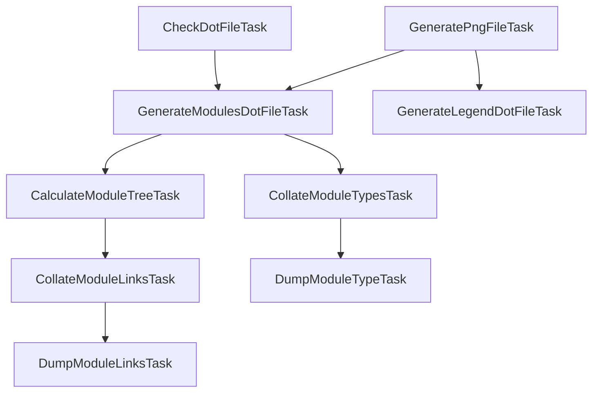

## Task Dependencies

> [!NOTE]
> Downwards arrow == "depends on"



For `DumpModuleLinksTask`, `DumpModuleTypeTask` and `CalculateModuleTreeTask`, one instance of each is registered for each of your smodules. All other tasks are attached on the root project. So your (filtered) task lists will look like below:

```
# Root project
calculateModuleTree
collateModuleLinks
collateModuleTypes
dumpModuleLinks
dumpModuleType
generateLegendDotFile

# Each subprojects
calculateModuleTree
dumpModuleLinks
dumpModuleType
```
