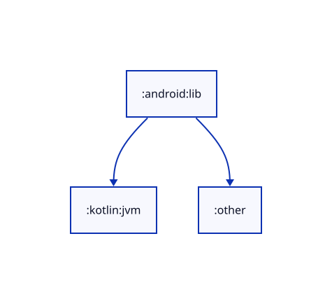
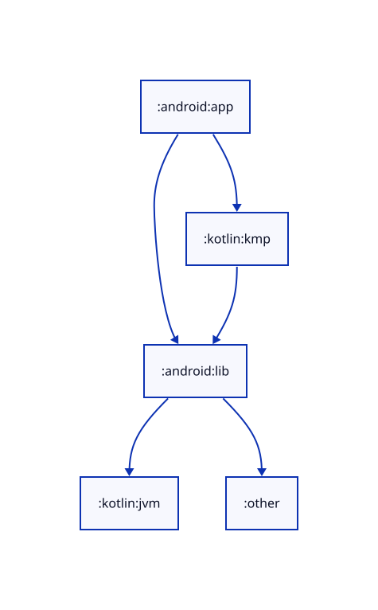
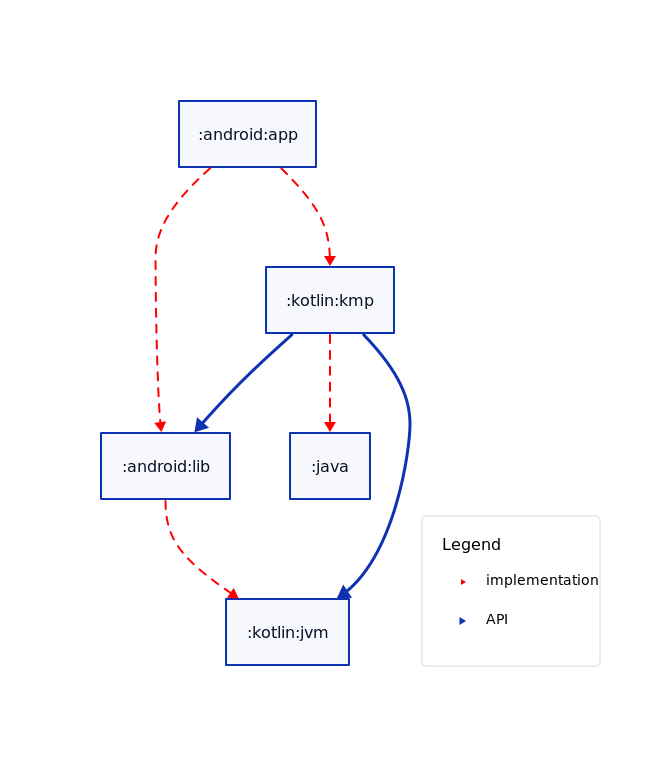
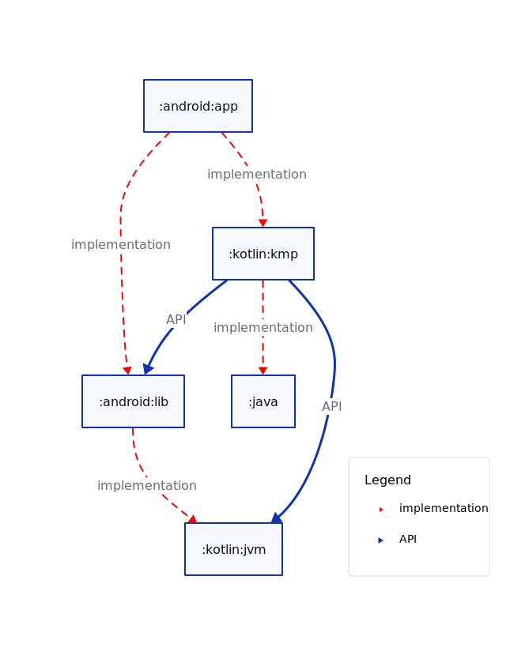
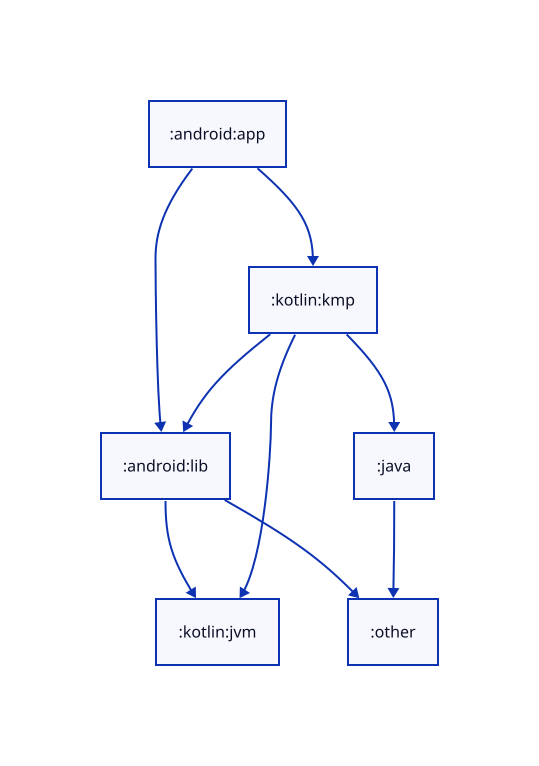
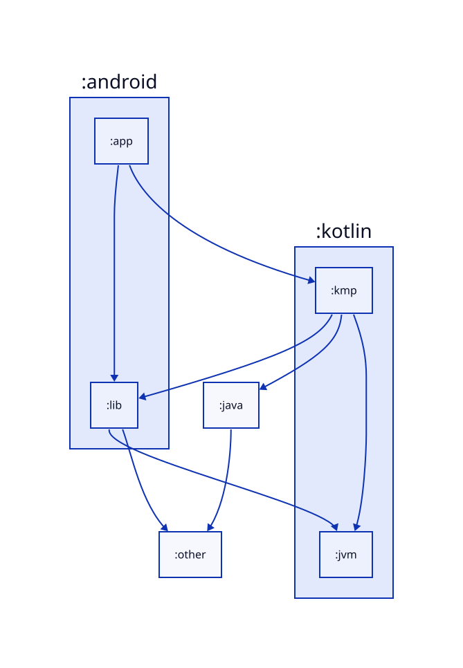
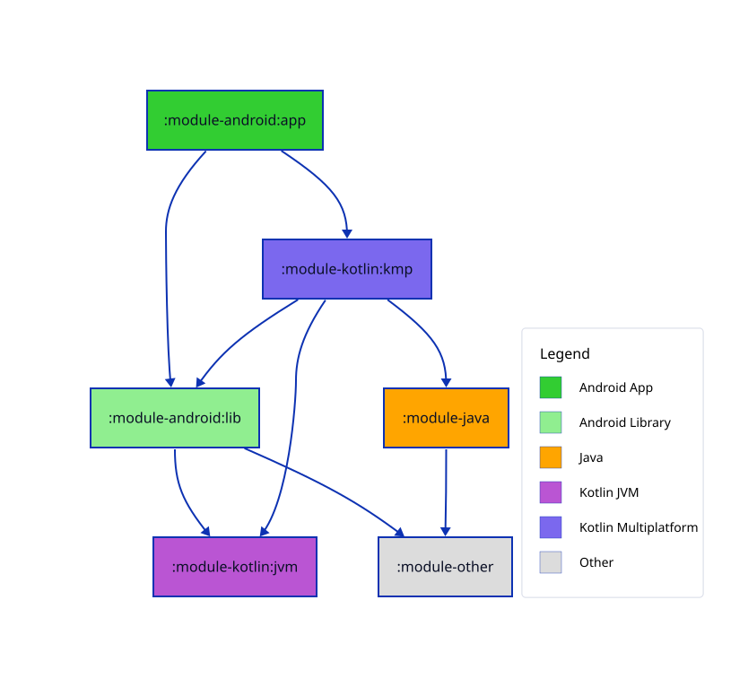

# Configuration

## Overview

Configuration is primarily done via the `atlas` Gradle extension function, accessible in your root build file. [See here for the KDoc](https://jonapoul.github.io/atlas-gradle-plugin/api/atlas-core/atlas.core/-atlas-extension), or [here for the source file](https://github.com/jonapoul/atlas-gradle-plugin/blob/main/atlas-core/src/main/kotlin/atlas/core/AtlasExtension.kt).

```kotlin
// none of these are required - these values are the defaults
atlas {
  alsoTraverseUpwards = false
  checkOutputs = true
  displayLinkLabels = false
  generateOnSync = false
  groupModules = false
  ignoredConfigs = setOf("debug", "kover", "ksp", "test")
  ignoredModules = emptySet<String>()
  printFilesToConsole = false

  pathTransforms {
    // ...
  }

  moduleTypes {
    // ...
  }

  linkTypes {
    // ...
  }
}
```

Alternatively, if calling from a `buildSrc` Kotlin file (or similar):

```kotlin
project.extensions.configure<AtlasExtension> {
  // ...
}
```

Any other configs beyond these are specific to the particular plugin you applied, see:

- [Graphviz](usage-graphviz.md)
- [D2](usage-d2.md)
- [Mermaid](usage-mermaid.md)

## alsoTraverseUpwards

```kotlin
atlas {
  alsoTraverseUpwards = true
}
```

If enabled, the generated module graph will also go "upwards", showing modules consuming this one, as well as the default "downwards" - modules being consumed by this one.

Examples below from the perspective of `:android:lib`:

| Disabled (default) | Enabled |
|:--:|:--:|
|  |  |

## checkOutputs

```kotlin
atlas {
  checkOutputs = true
}
```

If enabled, a diffing task will be attached to `gradle check`. It will verify that your generated charts match the current state of the project layout, failing if not with a useful error message. Enabled by default.

The generated task name will depend on your chosen framework (`D2`, `Mermaid` or `Graphviz`) and the file type that you're checking (`Chart` or `Legend`), e.g. `checkD2Chart` or `checkGraphvizLegend`.

Even if this option is disabled, the task will still be created, it just won't be attached to `gradle check`.

## displayLinkLabels

```kotlin
atlas {
  displayLinkLabels = true

  linkTypes {
    api(style = LinkStyle.Bold, displayName = "API")
    implementation(LinkStyle.Dashed, color = "red")
  }
}
```

When enabled, a string label is attached on each module link, showing which configuration caused represents the link. When true, the `LinkTypeSpec.name` property will be used. Disabled by default.

Requires some `linkTypes` to be declared - otherwise this will have no effect.

| Disabled (default) | Enabled |
|:--:|:--:|
|  |  |

## generateOnSync

```kotlin
atlas {
  generateOnSync = true
}
```

When enabled, syncing your IntelliJ IDE (including Android Studio) will automatically trigger regeneration of your module diagrams. Disabled by default.

!!! danger

    Be careful enabling this on larger projects - sync time might extend quite a bit.

## groupModules

```kotlin
atlas {
  groupModules = true
}
```

Set to true if you want module charts to gather together groups of modules into bordered containers. E.g. a graph with `":a"`, `":b"` and `":c"` won't be grouped at all because they don't share any path segments, but `":a:b"` and `"a:c"` will be grouped together. Disabled by default.

!!! tip

    Remember this will have no effect if your modules aren't nested at all.

!!! warning

    Automatic layout generation will get a bit complicated for larger projects when using grouping.

| Disabled (default) | Enabled |
|:--:|:--:|
|  |  |

## ignoredConfigs

```kotlin
atlas {
  ignoredConfigs = setOf("debug", "kover", "ksp", "test")
}
```

Use this to configure Gradle `Configuration`s to ignore when collating module diagrams. Gradle does have a load of configurations floating around (depending on your project) - most of which will be practically useless when generating a diagram like this.

Defaults to `setOf("debug", "kover", "ksp", "test")`.

!!! tip "Remember"

    If you don't ignore any configurations, you might end up with double links between modules - or broken builds

## printFilesToConsole

```kotlin
atlas {
  printFilesToConsole = true
}
```

Set to true to print the absolute path of any generated files to the Gradle console output. You can use this to help with scripting, if you like.

Disabled by default.

## moduleTypes

Use the `moduleTypes` block to identify module categories, along with the styling to apply to each one in the output chart. These stylings will depend on your choice of plugin (see their docs for details), but at a minimum, each with support setting:

- **label** string
- **color**, as a CSS color string (`"chartreuse"`) or hex string (`"#7FFF00"`)
- **matcher**, used to decide whether a given module should match this type:
    - **pathContains** - checks whether the module path (`":modules:path:to:my:module"`) contains a given string. Case sensitive.
    - **patchMatches** - same as `pathContains`, but uses Regex pattern matching. You can also pass a `regexOptions` parameter to configure this more specifically, if you need.
    - **hasPluginId** - checks whether the module has applied the given plugin ID string, e.g. `com.android.application` or `org.jebtrains.kotlin.jvm`.

  Only one of these three module matchers should be specified.

Sample usage:

```kotlin
atlas {
  moduleTypes {
    hasPluginId(
      name = "UI",
      color = "#ABC123",
      pluginId = "org.jetbrains.kotlin.plugin.compose",
    )

    pathMatches(
      name = "Data",
      color = "#ABCDEF",
      pathMatches = ".*data$".toRegex(),
    )

    pathContains(name = "Domain", pathContains = "domain") {
      // some custom config can go as a trailing lambda
      // the available options here depends on the plugin variant
    }
  }
}
```

A few module type quick-access functions are built into Atlas for use in the moduleTypes block if you need them:

```kotlin
atlas {
  moduleTypes {
    androidApp()
    androidLib()
    java()
    kotlinJvm()
    kotlinMultiplatform()
    other()

    // or useDefaults() to quickly add all of the above
  }
}
```

!!! warning

    Remember that the order of declaring module types does matter! When identifying a module, Atlas will use the first one and go down the list until it finds a match.

The below example shows one module of each of the built-in module types in a sample D2 project layout:



Remember also that you can pass framework-specific configuration options into any module type declarations used above, with a trailing lambda. Example below comes from D2:

```kotlin
atlas {
  moduleTypes {
    androidApp {
      shape = Shape.Hexagon
      strokeWidth = 10
    }

    kotlinMultiplatform()

    androidLibrary {
      fontColor = "red"
    }
  }
}
```

## linkTypes

Use this block to configure categories of link to be detected in your project and drawn onto the modules chart. These are detected by Gradle's configuration names. In most cases you'll probably use `api` and `implementation` as your main link types, so these are available as quick-access config functions:

```kotlin
atlas {
  linkTypes {
    implementation(color = "red")

    api(style = LinkStyle.Bold) {
      // custom config here - plugin-specific
    }
  }
}
```

!!! tip

    The `style` parameter on each of these will have different available options for each plugin. See the `LinkStyle` enum implementations for each one:

      - **Graphviz**: Bold, Dashed, Dotted, Invis, Solid, Tapered. [See here for details - specifically for "edges"](https://graphviz.org/docs/attr-types/style/)
      - **Mermaid**: Basic, Bold, Dashed, Invisible. [See here for details](https://mermaid.js.org/syntax/flowchart.html#links-between-nodes)
      - **D2**: Basic, Bold, Dashed, Dotted, Invisible. [See here for details](https://d2lang.com/tour/connections/)

Besides the default `api` and `implementation`, you can declare links representing other Gradle configurations too:

```kotlin
atlas {
  linkTypes {
    // All parameters are optional
    "compileOnly"(
      style = LinkStyle.Dotted,
      color = "#ABC123",
      displayName = "Compile-Only",
    )
  }
}
```

!!! warning

    As with module types, remember that the order of declaration matters! Top takes priority. So if you define "implementation" before "testImplementation", you won't get any links matching the latter because they all also match the former.

## pathTransforms

This is a little API for modifying module paths when inserting them into any generated diagrams. For example if your modules are all within a `"modules"` directory in your project's root, you might want to call something like:

```kotlin
atlas {
  pathTransforms {
    // ":modules:path:to:something" => "path:to:something"
    remove("^:modules:")

    // "path:to:something" => "path to something"
    replace(":", replacement = " ")
  }
}
```

Remember the declarations inside `pathTransforms` are called in descending order. It does not support regex group replacement (yet?) - regex is only used for pattern matching.
