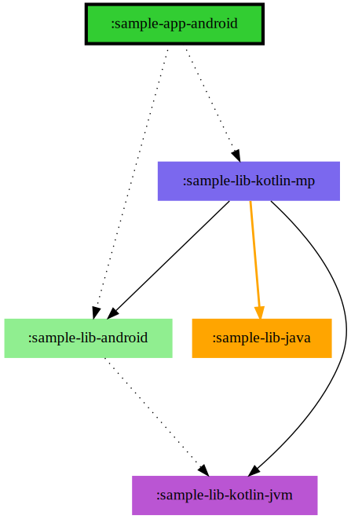
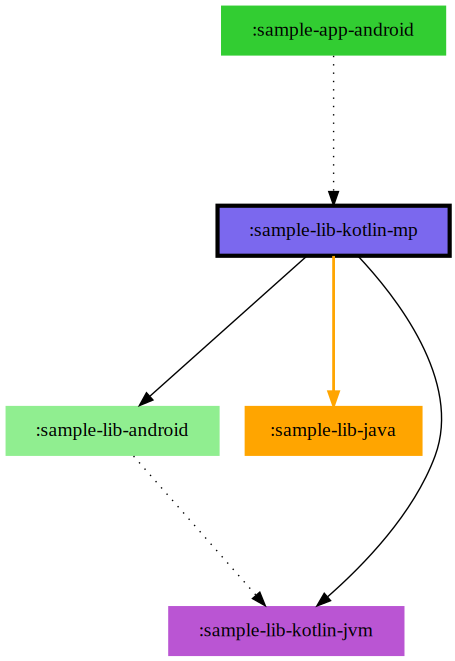
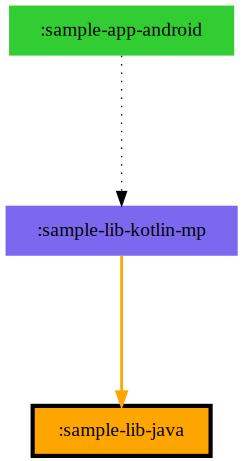

# Graphviz Sample Project

Same layout as [sample-mermaid](../sample-mermaid), but using Graphviz output for the diagrams. Check the config in [the root build file](build.gradle.kts).

This one is set with upwards traversal enabled, so you'll see library module charts also display downstream links. See the app and library charts compared below. The "target" module is the one with a bold outline.

Remember `sample-lib-java` isn't a direct downstream dependent of `sample-lib-kotlin-jvm`, so it doesn't appear in the latter's chart.

| sample-app-android                       | sample-lib-kotlin-jvm                       | sample-lib-android                       | sample-lib-kotlin-mp                       | sample-lib-java                       |
|------------------------------------------|---------------------------------------------|------------------------------------------|--------------------------------------------|---------------------------------------|
|  |  |  |  |  |

