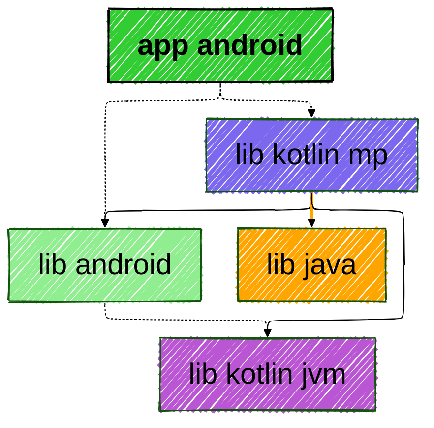

# sample-app-android

<!--region chart-->

| Module Types | Color |
|:--:|:--:|
| Android App |  |
| Kotlin Multiplatform |  |
| Android Library |  |
| Kotlin JVM |  |
| Java |  |
| Other |  |
| Link Types | Style |
|:--:|:--:|
| jvmMainImplementation | Orange Bold |
| api | Solid |
| implementation | Dotted |

<!--endregion-->
